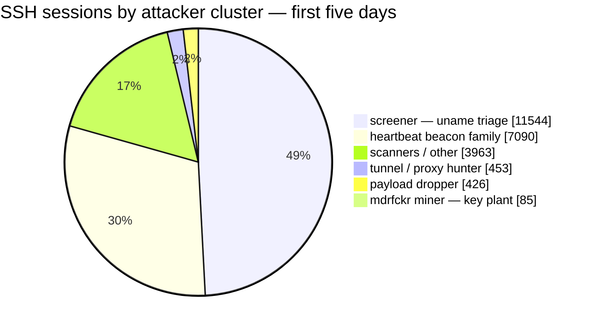
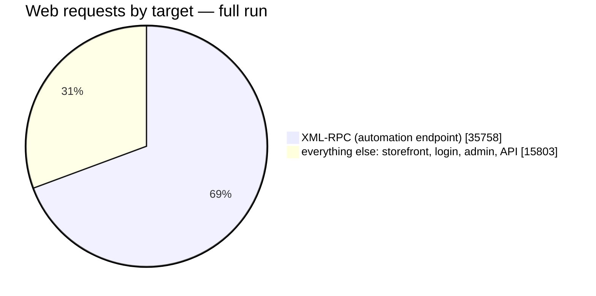

<!-- DRAFT-ONLY NOTES (delete before publish): the run is CLOSED — Sep 7 → Sep 13, 2026, seven days. Every number below is the closing cut (taken Sep 12, 15:53 UTC, the last report before the box was snapshotted); chart 1 is the one exception and stays a mid-run snapshot of the first five days, because extending it needs hourly logs that died with the box. Never name the host/IP/domain of a *live* lure — Run 2 is still running. Project post: publish + banner only (no audio, no LinkedIn). -->

> **TL;DR**
> - The bet: opportunistic attack bots are blind to who the target is. They attack services, not storefronts — a fake boutique domain should get the same pre-auth traffic as any public IP.
> - The archetype: the believable 2026 victim runs a current WordPress core with neglected plugins and a weak admin password. Not a 2019 core. The guides are wrong.
> - What I built: a decoy home-textiles store (real WordPress, real WooCommerce, ten products) on a disposable droplet, wrapped in watchers, with one deliberate weak point as the bait.
> - The result after seven days: 51,561 web requests and 29,481 SSH connections from 805 addresses, zero successful compromises, zero attackers who read the store, and the guessable admin password never guessed.

## Eleven thousand holes, six in the core

WordPress disclosed 11,334 vulnerabilities in 2025 — 91% of them in plugins, six in core ([Patchstack](https://patchstack.com/whitepaper/state-of-wordpress-security-in-2026/)). The independent dataset agrees: 96% plugin-side in 2024 ([Wordfence](https://www.wordfence.com/wp-content/uploads/2025/04/2024-Annual-WordPress-Security-Report-by-Wordfence.pdf)). Meanwhile Wordfence blocked fifty-five *billion* password attacks in a single year.

Now read almost any honeypot guide. They tell you to install an ancient, vulnerable WordPress and wait for the exploit bots.

That advice describes a victim that barely exists. Real small-business WordPress sites run a current core — the auto-updates just work — and get compromised through the layers nobody maintains: the plugin from 2022, the admin password the owner has not changed since the store opened. The compromise path is the neglected layer, and it is the same on every store on the internet.

## The bet nobody has measured

That last sentence is doing a lot of work, so let me separate the claims:

1. Bots are **lure-blind**: they hit login pages and plugin paths on every IP, regardless of what the site sells, what it looks like, or what domain it wears. Credential-stuffing runs at the scale of "41% of successful logins use leaked passwords, 95% of those attempts come from bots" ([Cloudflare](https://blog.cloudflare.com/password-reuse-rampant-half-user-logins-compromised/)) — that is not targeted behavior. Verizon's own SMB section calls the actors "opportunistic wide nets," not shoppers ([DBIR 2026](https://www.verizon.com/business/resources/Td15/reports/2026-dbir-data-breach-investigations-report.pdf)).

2. The interesting tail — context-aware credentials, staged recon, AI-era behavior — if it exists at all, it is rare. The prior is low. Zero targeted sessions in a month would not surprise me; it would confirm claim 1.

Here is the honest part: **no controlled 2024-2026 experiment varies a WordPress lure's version or content and measures what the attackers do.** Industry data is consistent with lure-blindness; nobody has run the A/B. Which means the interesting experiment is also the boring one to run: point one fresh, zero-reputation boutique domain at the internet and watch.

## Building the victim

The design goal was a store that looks like what a real attacker actually finds in the wild. That means:

- Recent WordPress core. Auto-updates off — the story is the owner disabled them after a plugin broke the site.
- WooCommerce with a real catalog: ten products, home textiles, prices that look right. A pillow cover at $28 and a duvet at $96.
- One deliberate weak point. Not an ancient core — a neglected plugin and a weak admin password. The guides want me to build a museum; I want to build a shop.
- A database full of fake customers — that is the real bait. The store carries a customer list, order history, reviews, and addresses, all generated the way a factory library seeds fixtures. The one thing a thief wants most is the one thing I invented. If an attacker enumerates the orders table or dumps the user list, they are not stealing anyone: they are showing me exactly which tables, which endpoints, and which tools they reach for. The checkout still does not accept cards — a carder testing stolen numbers gets logged and nothing else — so no real card number ever lands in my logs and no real person's data sits anywhere on the box.

The build had its moments. The domain registrar rejected both my credit cards — twice — so the store temporarily answers at a dynamic-DNS hostname that no real boutique would ever use. It stays up on that until the card problem dies, then it moves to a proper domain before launch. (A real business would not live on a free dynamic DNS name, and the decoy should not either — that is exactly the kind of tell the interesting attackers check.)

The WordPress one-click image from the cloud provider made the base believable in a way a hand-rolled stack never would be: real MySQL, real PHP-FPM, real Caddy, real processes in `ps`. Thousands of actual stores were installed exactly this way. The container-based honeypot stacks with their neat docker-compose files are the ones that smell wrong to anyone who checks `/proc`.

## The watchers

The storefront is the bait; it is not the honeypot. The honeypot is the environment:

- Every request hits an access log with full context.
- Failed logins and post-auth actions get caught by kernel-level and audit watchers.
- Outbound connections are blocked — an attacker who gets in can attempt downloads and persistence, and every attempt is recorded, but the box cannot be used to attack anyone else.
- Evidence ships off the box daily. The box is disposable; the data is not.

<!-- DRAFT NOTE (Gabriel, 2026-09-07): charts in the next section are native mermaid pies (theme-rendered, no CDN — Chirpy renders ```mermaid blocks automatically). A full interactive Chart.js version of the same data exists alongside (sources: assets/img/posts/chart1..4 .png + .html, CDN refs). BEFORE publishing, compare mermaid vs Chart.js rendering on the live post and pick the final one; that choice also affects the LinkedIn card if we screenshot a ChartJS chart. Status: chart1 = hourly timeline, mid-run cut (first five days) — that image could not be extended to the finish, the closing logs died with the box. chart2/3/4 = regenerated from the closing numbers (Sep 13 cut). -->

## The cast

Somewhere in the noise, faces appear. Not because anyone targeted the shop — nobody did — but because the machines attacking it carry habits, and over seven days the habits sort into characters.

- **The Screener.** Runs one command — `uname`, the Linux equivalent of "what are you?" — against every host it can reach, then leaves. 11,544 of the connections on port 22 were this machine taking inventory. It is the census taker of the internet.
- **The Beacon.** Logs in and types `echo xsec` — a heartbeat, checking that the shell works and phoning home. 7,090 visits. It never looked at the shop.
- **The Miner.** The most interesting one, because it is a real, documented criminal operation. It plants an SSH key so it can come back, and leaves a CPU check behind. Its key has not changed since 2018. Eight years, same trick, no arrests. By the end it had planted that key 110 times.
- **The Tunnel Hunters.** They want neither data nor money. They want the box as a relay — a hop that hides where their traffic really comes from. Seven separate attempts to open a tunnel to the same outside address. That is how an innocent server becomes an accessory.
- **The XML-RPC Flood.** Wave after wave against WordPress's automation endpoint, each burst from a freshly rented server, gone before the invoice arrives.
- **The Login Stuffer.** Drips usernames against the login page for hours, rotating browsers to look human, sitting behind a proxy so the real origin never shows. One of them posted 81 username-and-password pairs lifted from a real breach — a Thai gambling site's leak, pointed at a home-textiles store in Oregon. It never read a single product page.
- **The Backdoor Artist.** The only one with craft: it checks whether the shell it landed in is real before installing a fake one of its own. On a real host that would matter. Here, it verified a shell that does not exist.
- **The Shopper.** The one I cannot fully explain. It browsed the catalog like a customer — products, cart, checkout, even "forgot my password." Every other visitor hammered the plumbing; this one behaved like it wanted to buy something. Best guess: an automated agent pacing itself like a human. I cannot prove it yet. It is the closest anything came to noticing what the shop was for.

And one that is not a character but a change in the weather. For the first four days port 22 was passive: scan, run `uname`, hang up. In the closing 48 hours that reversed — 8,985 of 10,028 sessions stayed long enough to type commands, a new brute-force botnet arrived with sixteen addresses out of one subnet, and a multi-architecture malware family started uploading itself in five builds at once. The targets never changed; only how hard they pushed.


*The mix flipped at the end: for the first four days most of port 22 was inventory-taking; in the closing 48 hours nine in ten sessions stayed to run commands.*

Nobody read the store. Every credential tried against the login was built from the domain name or lifted from a leaked list — never from the boutique's own story. The interesting tail stayed empty.

## The noise, in numbers

Seven days in, the commodity noise has a shape: **51,561 web requests and 29,481 SSH connections from 805 addresses.** The volume arrived in waves, not a tide — a launch burst, botnet sweeps, a credential-stuffing run that never quite stopped, and then, before the end, the wave simply died: the web flood fell from 12,896 requests in a day to 2,222, an 82% collapse, with no change on my side.

The SSH noise was not a crowd — it was clusters with different goals, from mass host-triage to a miner planting its persistence key:



*The screener triages every host it finds; the miner's key has been unchanged since 2018. Cut at day five — the closing cluster split died with the box.*


*Static render of the first five days (double axis: web left, SSH right) — mermaid has no time-series charts, so the timeline stays as an image. This is the one chart that could not be extended to the finish: it needs hour-by-hour logs, and the box's were destroyed with the box.*

Most of those web requests were not for the store at all. Break them down and the picture is lopsided in a way that makes the bet look very safe:




*Nearly seven in ten of everything that hit the box went to XML-RPC — the automation endpoint WordPress exposes for tooling and pingbacks. Not the catalog, not the products, not the boutique. Through the first five days — the last cut where the classes were counted separately — around one request in seven touched the part of the site that looks like a shop.*

## Seven days in

The run is closed. The noise arrived on schedule: SSH triage in waves, XML-RPC floods from infrastructure that rotates every pass, login stuffing that pauses and resumes like a tide. The machines change; the tricks do not.

And the interesting tail? Still no datapoint. 1,720 credentials were tried against the login, and the most-tried username is the one WordPress leaks by default. The account I deliberately made guessable — a plain `admin`, password derived from the store's own About page — drew **ten attempts in seven days, none of them correct.** Across 913 parsed attempts nobody tried the password the store's own story hints at; the closest was the brand-and-year family in lowercase with no `!`, three keystrokes short. The owner's name got 195 attempts and a walk up the years that stopped at 2018 — never the year the store was founded.

As a sanity check on the "an AI agent would crack this" argument I ran the reverse experiment: a frontier model, told the username and handed the store's own content, guessed ten passwords and got zero — on the bait account and the owner's both. Its third guess was the brand and the right year, one capital letter and one `!` away. The model was not smarter than the bots; it was closer to the shape of the answer.

Seven days, zero "smart" attackers. That null result is the finding.

## What did not happen

- Nobody read the store. No attacker touched the catalog as content — they hit the login, the admin path, and the API, which are identical on every WordPress site on earth.
- Nobody reached the bait. The 46 fake orders and 20 fake customers sat untouched, and the deepest actor ended in a shell that does not exist, holding a key to nothing.
- No AI-era signals: no agentic session, credential, or payload. What arrived was traditional and decades old in technique — with two exceptions worth naming, because they were real criminal operations. One campaign pulled a script from a server VirusTotal already flags; another uploaded a five-architecture miner-and-worm family that masquerades as the SSH daemon.

One side finding, from running the attacker addresses past VirusTotal: the two populations split cleanly. SSH botnets are dirty — 7 of 8 addresses flagged — while the web-campaign infrastructure is freshly rented and clean. VirusTotal will flag the next SSH wave and shrug at the next XML-RPC one.

## Closed, and running

Everything on the launch checklist ran for the full week: fake customers in the database, the fake SSH shell answering on port 22, outbound traffic blocked and logged, the store live on its proper boutique domain. At the end I kept a full image of the box and destroyed the droplet — the data outlives the decoy, as designed.

Seven days, 805 addresses, zero targeted attackers. The bet holds. Nobody attacked the boutique — they attacked WordPress, and a boutique was standing there.

*Draft note: THE single honeypot post — one start-to-finish story. NON-technical (keep MySQL/PHP-FPM/Caddy/Falco/auditd internals OUT unless Gabriel changes his mind). The pre-registered protocol + hypotheses + metrics live in the honeypot-ops skill, not in this post. Run 2 is already live and answers the two questions this run could not — whether anyone reads a lure's content to derive credentials, and whether the crawler/agent population finds it. No dates promised here; a second post is a decision, not an obligation.*
