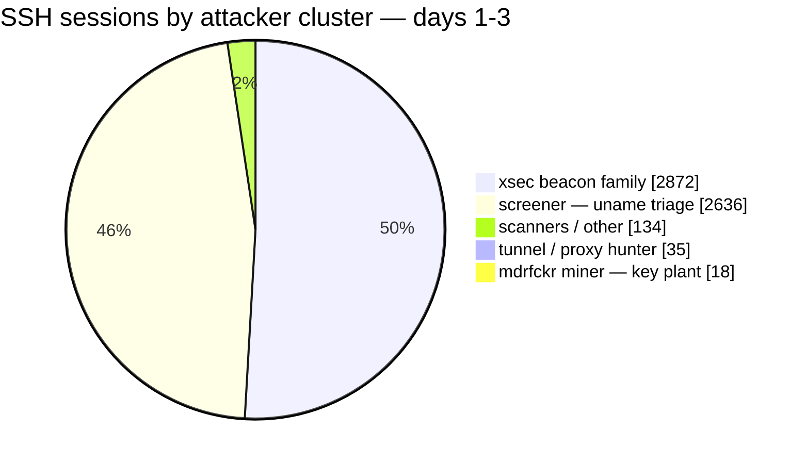
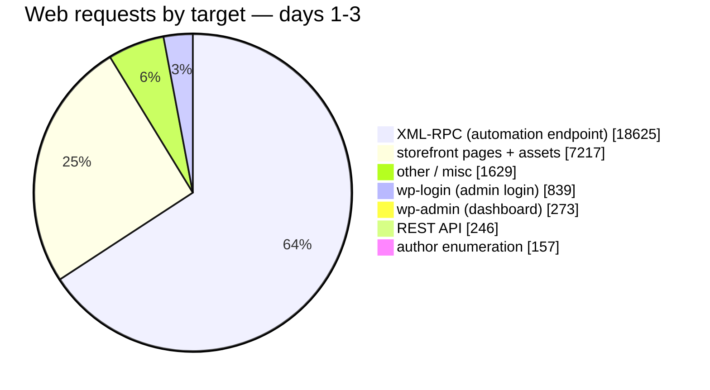

<!-- DRAFT-ONLY NOTES (delete before publish): publish AFTER the 30-day run + analysis. Never name the live lure host/IP/domain while the experiment runs — refer to it generically ("a fresh boutique domain"). Project post: publish + banner only (no audio, no LinkedIn). -->

> **TL;DR**
> - The bet: opportunistic attack bots are blind to who the target is. They attack services, not storefronts — a fake boutique domain should get the same pre-auth traffic as any public IP.
> - The archetype: the believable 2026 victim runs a current WordPress core with neglected plugins and a weak admin password. Not a 2019 core. The guides are wrong.
> - What I built: a decoy home-textiles store (real WordPress, real WooCommerce, ten products) on a disposable droplet, wrapped in watchers, with one deliberate vulnerability as the bait.
> - Honest expectation: thirty days of data, probably zero "smart" attackers, and that null result is itself the finding.

## Eleven thousand holes, six in the core

WordPress disclosed 11,334 vulnerabilities in 2025 — 91% of them in plugins, six in core ([Patchstack](https://patchstack.com/whitepaper/state-of-wordpress-security-in-2026/)). The independent dataset agrees: 96% plugin-side in 2024 ([Wordfence](https://www.wordfence.com/wp-content/uploads/2025/04/2024-Annual-WordPress-Security-Report-by-Wordfence.pdf)). Meanwhile Wordfence blocked fifty-five *billion* password attacks in a single year.

Now read almost any honeypot guide. They tell you to install an ancient, vulnerable WordPress and wait for the exploit bots.

That advice describes a victim that barely exists. Real small-business WordPress sites run a current core — the auto-updates just work — and get compromised through the layers nobody maintains: the plugin from 2022, the admin password the owner has not changed since the store opened. The compromise path is the neglected layer, and it is the same on every store on the internet.

## The bet nobody has measured

That last sentence is doing a lot of work, so let me separate the claims:

1. Bots are **lure-blind**: they hit login pages and plugin paths on every IP, regardless of what the site sells, what it looks like, or what domain it wears. Credential-stuffing runs at the scale of "41% of successful logins use leaked passwords, 95% of those attempts come from bots" ([Cloudflare](https://blog.cloudflare.com/password-reuse-rampant-half-user-logins-compromised/)) — that is not targeted behavior. Verizon's own SMB section calls the actors "opportunistic wide nets," not shoppers ([DBIR 2026](https://www.verizon.com/business/resources/Td15/reports/2026-dbir-data-breach-investigations-report.pdf)).

2. The interesting tail — context-aware credentials, staged recon, AI-era behavior — if it exists at all, it is rare. The prior is low. Zero targeted sessions in thirty days would not surprise me; it would confirm claim 1.

Here is the honest part: **no controlled 2024-2026 experiment varies a WordPress lure's version or content and measures what the attackers do.** Industry data is consistent with lure-blindness; nobody has run the A/B. Which means the interesting experiment is also the boring one to run: point one fresh, zero-reputation boutique domain at the internet and watch.

## Building the victim

The design goal was a store that looks like what a real attacker actually finds in the wild. That means:

- Recent WordPress core. Auto-updates off — the story is the owner disabled them after a plugin broke the site.
- WooCommerce with a real catalog: ten products, home textiles, prices that look right. A pillow cover at $28 and a duvet at $96.
- One deliberate weak point. Not an ancient core — a neglected plugin and a weak admin password. The guides want me to build a museum; I want to build a shop.
- A database full of fake customers — that is the real bait. The store carries a customer list, order history, reviews, and addresses, all generated the way a factory library seeds fixtures. The one thing a thief wants most is the one thing I invented. If an attacker enumerates the orders table or dumps the user list, they are not stealing anyone: they are showing me exactly which tables, which endpoints, and which tools they reach for. The checkout still does not accept cards — a carder testing stolen numbers gets logged and nothing else — so no real card number ever lands in my logs and no real person's data sits anywhere on the box.

The build had its moments. The domain registrar rejected both my credit cards — twice — so the store temporarily answers at a dynamic-DNS hostname that no real boutique would ever use. It stays up on that until the card problem dies, then it moves to a proper domain before launch. (A real business would not live on a free dynamic DNS name, and the decoy should not either — that is exactly the kind of tell the interesting attackers check.)

The WordPress one-click image from the cloud provider made the base believable in a way a hand-rolled stack never would be: real MySQL, real PHP-FPM, real Caddy, real processes in `ps`. Thousands of actual stores were installed exactly this way. The container-based honeypot stacks with their neat docker-compose files are the ones that smell wrong to anyone who checks `/proc`.

## The watchers

The storefront is the bait; it is not the honeypot. The honeypot is the environment:

- Every request hits an access log with full context.
- Failed logins and post-auth actions get caught by kernel-level and audit watchers.
- Outbound connections are blocked — an attacker who gets in can attempt downloads and persistence, and every attempt is recorded, but the box cannot be used to attack anyone else.
- Evidence ships off the box daily. The box is disposable; the data is not.

<!-- DRAFT NOTE (Gabriel, 2026-09-07): charts in this section are native mermaid pies (theme-rendered, no CDN — Chirpy renders ```mermaid blocks automatically). A full interactive Chart.js version of the same data was built and validated (sources: assets/img/posts/chart1..4 .png; the .html sources were moved out of the repo 2026-09-08 because their local file:// lib refs broke the CI HTML-Proofer — backup at ~/honeypot-evidence/chart-html-backup/, libs in ~/.hermes/scripts/honeypot-charts, regenerable). BEFORE publishing, compare mermaid vs Chart.js rendering on the live post and pick the final one; that choice also affects the LinkedIn card if we screenshot a ChartJS chart. Replace the Day-1 preview numbers with the full 30-day run at publish. -->

## The noise, in numbers

Three days in, the commodity noise has a shape: 5,695 SSH connections and 28,986 web requests from 508 IPs. Mid-run preview numbers — the full 30-day run replaces them at publish.

The SSH noise was not a crowd — it was clusters with different goals, from mass host-triage to a miner planting its persistence key:



*The largest cluster is a botnet that re-checks its victims with a beacon; the miner's key has been unchanged since 2018.*

The volume arrived in waves, not as a tide — launch burst, botnet sweeps, then a credential-stuffing run:


*Static render — mermaid has no time-series charts, so the timeline stays as an image (Chart.js interactive alternative exists if we want it live).*

Most of those web requests were not for the store at all. Break them down by target and the picture is lopsided in a way that makes the bet look very safe:



Almost two-thirds of everything that hit the box went to XML-RPC — the automation endpoint WordPress exposes for tooling and pingbacks. Not the catalog, not the products, not the boutique. The admin login, the dashboard, and the API took most of the rest. The part of the box that looks like a shop drew barely a quarter of the noise.

## Three days in

The run is live — day three of thirty. The commodity noise arrived on schedule: waves of SSH triage, XML-RPC floods from infrastructure that rotates every pass, login stuffing that pauses and resumes like a tide. The machines change; the tricks do not.

And the interesting tail? Still no datapoint. Nobody has read the store first — no catalog-aware password, no staged recon, no session that behaved like it knew what the shop was for. Every credential tried against the login has been a variation of the domain name or a leaked-list username. The honest expectation is holding: thirty days of data, probably zero "smart" attackers. That null result is the finding.

## Built, and running

Everything on the launch checklist is done — the fake customers sit in the database, the fake SSH shell answers on port 22, outbound traffic is blocked and logged, and the store lives on its proper boutique domain. What remains is the slowest step: the rest of the thirty days, then the writeup with the full numbers.

*Draft note: THE single honeypot post — one start-to-finish story. NON-technical (keep MySQL/PHP-FPM/Caddy/Falco/auditd internals OUT unless Gabriel changes his mind). The pre-registered protocol + hypotheses + metrics live in the honeypot-ops skill (`references/honeypot-protocol.md`), not in this post. Hold until the 30-day run completes.*
