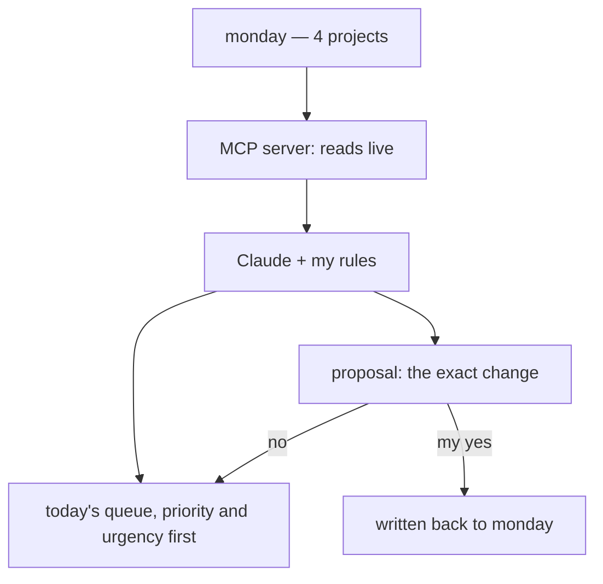

> **TL;DR**
>
> - I have always kept a list for the day. Five or six lines, tick them off, and the dopamine carries the afternoon.
> - Four projects on monday turned making that list into the hardest part of my morning.
> - Now Claude reads monday live and hands me the queue. It asks before it writes.

You know the feeling: so many tasks that you do not know where to start.

I never had a problem with lists. I like them, and I have liked them for as long as I can remember. What broke was producing the list. Four projects, each with its own workspace and its own idea of priority. The same job in two places, because one team tracked it as their work while another carried it in a report. Rows with no note on what "done" meant. My first hour went into deciding what the day was.

Now I ask for it.

Nothing in that path is clever. The rules are a file I edit by hand: which boards to read, which columns matter, what is off limits. The local copy of my tasks is a fallback for when the connection dies, never the source of truth. If the MCP is down, a couple of Python scripts do the same reads through the API, so nothing on the critical path depends on a model being up.

The line I type most is the plainest one: *give me the queue for today*. Priority and urgency first, the project next to each item. What comes back is the list I used to build by hand, minus the hour. Then the two recaps: what moved before I close the laptop, and the same over the week on Friday. Those go into the standup.

## What came along

**Duplicates.** Seventeen rows across four projects, five of them the same work in different clothes, and one triple. Grouping rows that describe one job is easy to describe and tedious to do, which is the shape of work that suits this. Seventeen rows became twelve real items.

**Questions.** Tasks with no detail, and nobody who remembered writing them. Instead of guessing I bounce them off the assistant and get the questions for whoever owns the task. "Do you want the report or the raw numbers?" is one line to send, and the task closes after the answer.

**Notes.** Every closed task leaves a short record: who wanted it, what the deliverable was, what "done" meant that time. Next time the same project shows up, the context is there.

I did not need a new method. I needed the list I already trusted, built before I open the laptop.
